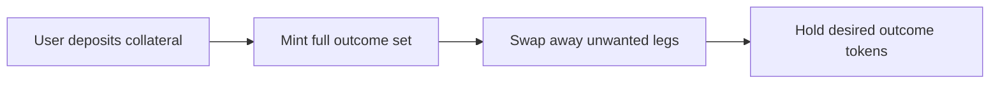

# Complete sets vs “pick one outcome” — design note and options

## Product decision (recorded)

| Goal | Description | Status |
|------|-------------|--------|
| **1 — Explain-only** | Users understand complete-set mechanics; participation UI explains full-bundle mint/redeem; no in-app swap. | **Current** |
| **2 — Guided directional participate** | Same program; UI composes `mint_complete_set` + external swap (e.g. Jupiter) so the flow *feels* like “pick one outcome.” | Future — see [Follow-up: Goal 2](#follow-up-goal-2--guided-directional-ux) |
| **3 — On-chain AMM / single-leg mint** | New instructions and liquidity state (or separate program) for single-instruction directional exposure. | Future — see [Follow-up: Goal 3](#follow-up-goal-3--protocol-level-amm) |

Rationale for **Goal 1 now**: the deployed program exposes only complete-set mint/redeem plus post-resolution `redeem_winning`. Shipping clear copy and this document matches the on-chain reality without new dependencies or audits.

---

## Why the UI cannot offer “mint only one outcome” today

The program ([`programs/prediction_market/src/lib.rs`](../programs/prediction_market/src/lib.rs)) exposes:

- **`mint_complete_set`** — collateral in → mint **all** outcome tokens (one SPL mint per outcome).
- **`redeem_complete_set`** — burn **one unit of each** outcome token → collateral back.
- **`redeem_winning`** — after resolution, burn **winning** outcome tokens only → collateral.

There is **no instruction** to mint a single outcome token in isolation. The UI cannot honestly offer “pick Brazil only” as a **single** on-chain action without another mechanism.

---

## Why protocols often use complete sets as the core primitive

- **Conservation:** A fixed amount of collateral maps to one full bundle of outcome tokens; accounting stays simple.
- **Vault symmetry:** The market vault holds collateral; mint and full-set redeem are inverse operations.
- **Resolution:** Once the winning outcome index is known, `redeem_winning` is well-defined.

**“Buy only one outcome”** is a different economic primitive: it usually implies **trading** (order book, pool) or an **AMM** that prices a single leg while keeping the system solvent. That needs extra math, state, and often liquidity — not just a different button label.

So complete-set mint is a **minimal on-chain core**; retail “pick A / B / C” flows are often built **on top** (see below).

---

## How “pick one outcome” UX is usually achieved

The experience can be “I only bought Brazil” while the chain does:

1. Mint the **full** outcome set (collateral → all outcome tokens), then  
2. **Swap** away the legs you do not want (or an AMM batches both).

---

## Options comparison

| Direction | What changes | Complexity |
|-----------|----------------|------------|
| **Copy / education** | Clarify in-app and in docs; no program change | Low |
| **App composes two steps** | After `mint_complete_set`, invoke a **swap** (e.g. Jupiter) to sell unwanted outcome mints | Medium — router integration, ATAs, slippage, liquidity |
| **On-chain AMM / single-leg mint** | New instructions + liquidity state or new program | High — economics + audits |

Option 2 can feel like “pick one” **without** changing vault math, if users accept **multiple instructions** (or one transaction with several instructions) and there is **liquidity** for outcome-token pairs.

---

## Follow-up: Goal 2 — guided directional UX

**Objective:** Wizard: amount + chosen outcome → `mint_complete_set` then swap **from** every non-chosen outcome mint **to** collateral (or stable) via Jupiter (or another router).

**Likely touchpoints:**

| Area | Work |
|------|------|
| [`app/web/src/pages/MarketDetail.tsx`](../app/web/src/pages/MarketDetail.tsx) | New flow section; slippage / quote preview; clear disclosure (“two steps” or batched tx). |
| [`app/web/src/lib/marketActions.ts`](../app/web/src/lib/marketActions.ts) | Orchestrate mint + swap; ensure outcome ATAs exist; handle partial failure. |
| New helper module | Jupiter quote/swap API (cluster-specific), token route discovery for outcome mints. |
| Dependencies | `@jup-ag/api` or REST client; wallet adapter for multi-ix transactions. |

**Risks:** No route if outcome tokens have no pool; user ends up holding full set; must set expectations in UI.

---

## Follow-up: Goal 3 — protocol-level AMM

**Objective:** Single instruction (or dedicated program) that prices “collateral for only outcome *i*” with on-chain liquidity and invariants.

**Work:** New account layouts, instruction handlers, tests, audit — out of scope for the web app alone; requires program design and economic review.

---

## Related UI

The market detail **Participate** section documents Goal 1 behavior end-user-facing. This file is the longer-lived product/engineering reference.
